# 車のモデル（任意）をAsset Storeから取得してインポート

今回は以下のモデルを使用します。

https://assetstore.unity.com/packages/3d/vehicles/land/cartooncars-01-75898

このモデル以外でも基本的には問題ありません。ただし、状況に応じて手順を変える必要が出る場合があります。

次にアセットをインポートします。

-  **マイアセットに追加（要ログイン）** し、 **Unityで開く** を選択

この操作はUnityのバージョンによって変化する可能性があります。そのバージョンの操作に従ってください。

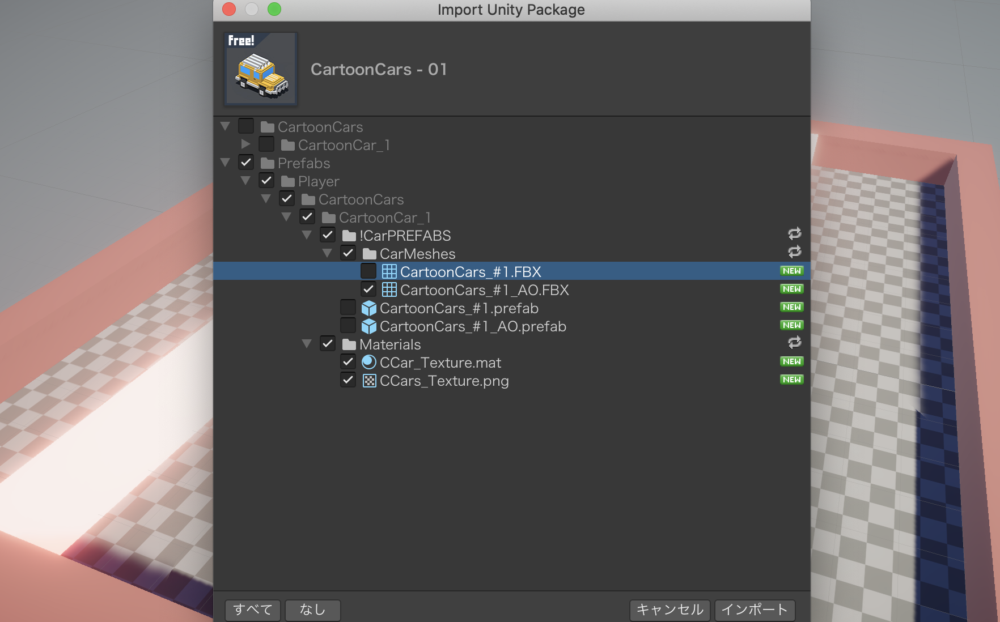

インポートするファイルは以下の通りです。

-  CartoonCar_1/CarPREFABS/CarMeshes/CartoonCars_#1_AO.FBX
-  CartoonCar_1/CarPREFABS/Materials/CCar_Texture.png
-  CartoonCar_1/CarPREFABS/Materials/CCar_Texture.mat

もしUniversal Render Pipelineを使用している場合、シェーダーを更新してください。

-  `メニュー > RenderPipeline > Universal Render Pipeline > Update Project Materials to Universal Render Pipeline` を選択

# アセットの調整

インポートしたモデルは、実は少しサイズが大きいです。また、初期の向きに問題があります。これを調整します。

最初にモデルをプレハブにして編集可能にします。基本的にモデルをプレハブ化する場合はPrefab Variant（プレハブバリアント）を選択してください。プレハブ（原型）を使用すると、モデルの設定変更に伴いGameObjectの構成が崩壊する事があります。

-  **CartoonCars_#1_AO.FBX** を右クリックし、 **作成 > Prefab Variant** を選択
-  作成した **CartoonCars_#1_AO Variant** の名前を **Car Prefab** に変更

シーンにモデルを配置します。すると玉と比較して非常に大きいのでサイズを調整します。

このとき、Prefab側で調整しても良いですがモデル側で変更した方がGameObjectのスケールを(1,1,1)で統一できるので、モデル側で調整します。

-  **Car Prefab** をシーン上にドラッグ＆ドロップ。モデルの大きさが玉よりも遥かに大きい事をシーンビューで確認
-  **CartoonCars_#1_AO.fbx** を選択し、 **スケールファクター** を **0.2** に変更

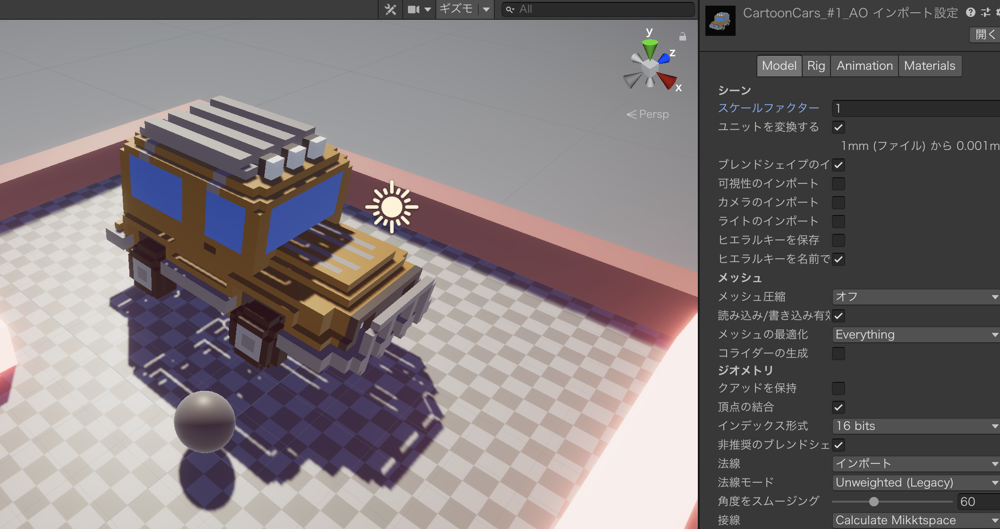
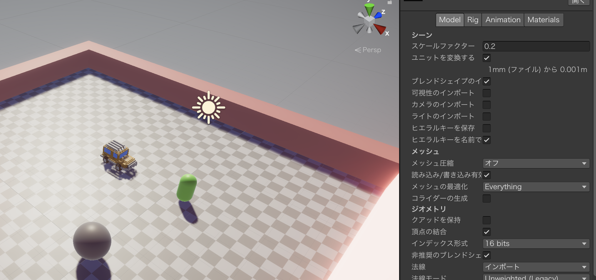


次にCar Prefabの向きを調整します。CarPrefabの車モデルは、初期設定では赤い矢印の方向を向いています。これはｘ軸（右）の方向です。大抵の場合 キャラクターはz軸（奥）の方向に向いていて欲しいです。これを調整します。

-  アセットの **Car Prefab** をダブルクリックし、プレハブエディターを開く
-  **Eキー** を押し、ハンドルを回転モードに変更
-  ツールハンドルがピボット（pivot）だった場合、中心（Center）に変更し、プレハブ以下の **CCar_01** や **CCar_01_Wheel_◯◯** を全て選択
-  右上のギズモ（xyzの錐体が刺さってる四角形）の青（z軸）の向きが前方になるように、モデルを回転させる。（このとき Ctrl を押しながら操作すれば15度単位で操作出来る）
-  Hierarchyの **<** を押してプレハブモードを抜けます。Prefab has been modified（プレハブは変更されています。セーブしますか？）と聞かれたら**Save** を選択

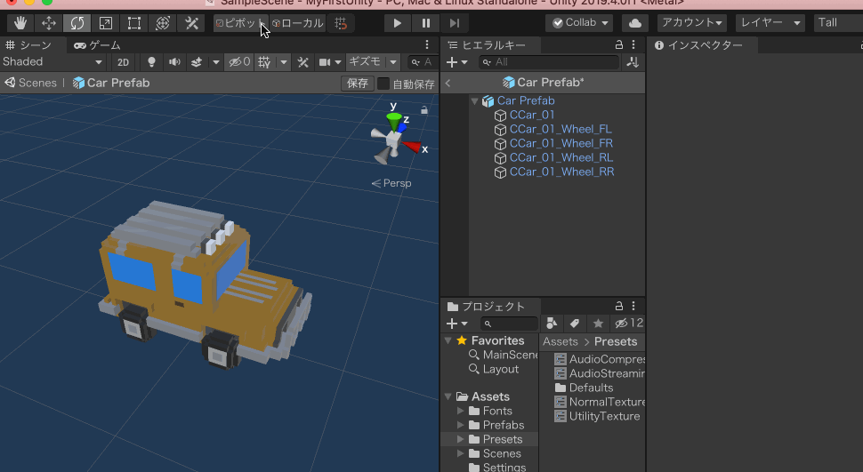

>hit:

> **メニュー > 編集 > Grid and Snap Settings** を開き、**回転** を **45** に変更すると、 **Ctrl を押しながら回転する際に45度単位でスナップさせることができます** 。
>
>また **移動** を 0.25から 1 に変更すると、１m単位でスナップさせることができ、All Axisボタンで **スナップの単位でオブジェクトの位置を整列** させることができます。

シーンに戻り確認すると、大きさは概ね問題無いですが影が変な所で穴が空いているので、これを修正します。

-  アセットの **Car Prefab** をダブルクリックし、プレハブエディターを開く
-  **CCar_01** オブジェクトを選択
-  ライティングの **投影** を、オンから **両面** に変更
-  Hierarchyの **<** を押してプレハブモードを抜ける


# 車の座標と玉の座標を同期しよう！

車の座標と玉の座標を同期します。このとき車を玉の子オブジェクトとして配置すると車が回転してしまうので、座標を同期するスクリプトを用意します。

-  `SyncModelTarnsform` スクリプトを作成し、下のコードを記述します。

```cs
using UnityEngine;

public class SyncModelTarnsform : MonoBehaviour
{
    public Transform ModelTransform;

    public Vector3 Offset;

    void FixedUpdate()
    {
        ModelTransform.position = transform.position + Offset;
    }
}
```

作成したスクリプトをシーン上のオブジェクトに設定していきます。

-  プレイヤー（玉）を選択し、「コンポーネントを追加」ボタンを選択し `SyncModelTarnsform` を追加
-  SyncModelTransformの **ModelTransform** に、さきほどシーンに配置した **Car Prefab** を設定
-  SyncModelTransformの **Offset** に **(0, -0.5, 0)** を設定

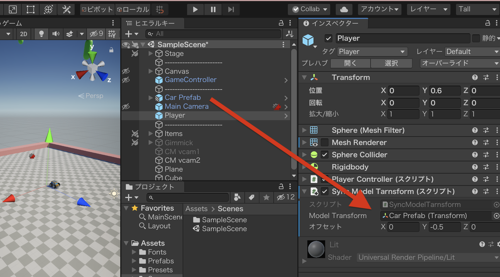


ゲームを動かすと、玉の座標と車の座標が同期します。

上手く動いてるように感じたら、Playerの`MeshFilter`と`MeshRenderer`を削除もしくは無効化します。


# 車をハンドル操作にしよう！

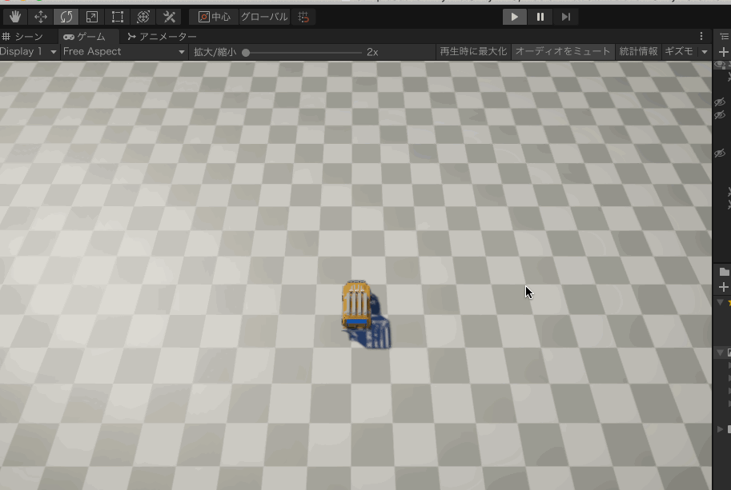

車をハンドルで操作するような感じの操作感にします。まずは動き（PlayerController）の方を更新します。

この挙動を他のコンポーネントが使用するので、幾つかのパラメーターはインターフェースで使用可能にしておきます。これでPlayerControllerを他のコンポーネント（例えばAI Controller等）に変更しても、後々用意するコンポーネントを再利用できます。

-  `PlayerController` を下記のように変更する。

```cs
using UnityEngine;

public interface ICar
{
    Quaternion LocalRotation{get;}
    float Handle{get;}
    Vector3 Forward{get;}
        
}

public class PlayerController : MonoBehaviour, ICar
{
    [SerializeField] float Speed = 10;
    [SerializeField] float RotationSpeed = 7;

    Rigidbody rig;

    public Quaternion LocalRotation{get; private set;}
    public float Handle{get; private set;}
    public Vector3 Forward{get; private set;}
    
    void Awake()
    {
        rig = GetComponent<Rigidbody>();
        LocalRotation = transform.rotation;
    }

    void FixedUpdate()
    {
    	// ハンドル情報を更新し、ハンドル方向にLocalRotatoinを回す。
        Handle = Input.GetAxis("Horizontal");
        LocalRotation *= Quaternion.AngleAxis(Handle * RotationSpeed, Vector3.up);

        // LocalRotatoinの前方を取得し、その方向に進むように力を加える
        Forward = LocalRotation * Vector3.forward ; 
        rig.AddForce(Forward * Speed);
    }
}
```

次に、PlayerControllerの情報を元に、表現の方を更新します。

まずはSyncModelTransformを座標の同期だけでなく回転も同期します。

-  `SyncModelTransform` を下記のように変更します。

```cs
using UnityEngine;

public class SyncModelTarnsform : MonoBehaviour
{
    public Transform ModelTransform;

    public Vector3 Offset;

    ICar car;

    void Awake()
    {
        TryGetComponent<ICar>(out car);
    }

    void FixedUpdate()
    {
        ModelTransform.position = transform.position + Offset;
        ModelTransform.rotation = car.LocalRotation;
    }
}
```

これでAキーとDキーで向きを変えながら進みつつ、ドリフトっぽい動きをする車が出来ました。


## 車の傾きを表現しよう！

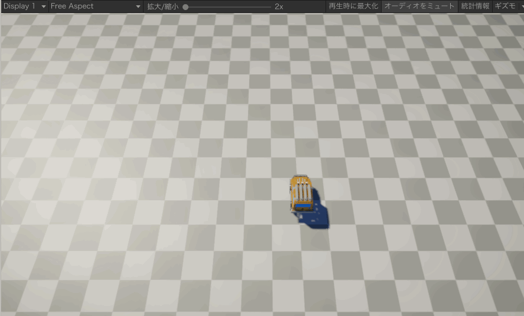

ハンドルを傾けているとき、車を傾けるような動きを設定します。

まずはアニメーションを作成します。

-  CarPrefabをプレハブエディターで開く
-  CarPrefabを選択し「コンポーネントを追加」を押下、Animatorコンポーネントを追加
-  **Ctrlキー + 6キー**を押し、アニメーションウインドウを開く
-  アニメーションウインドウで **作成** ボタンを押し、**Left Turn**を作成
-  アニメーションウインドウのレコードボタン（赤い丸のボタン）を押し、左にカーブしているときの車の傾きを表現させる。具体的には、 CCar_01の**座標を（0.209, -0.2641231, -0.046）** 、 回転を **（-108, 90, -180)** に設定。この値は感性で微調整すべき
-  アニメーションウインドウのLeftTurnを選択し、**新しいクリップを作成** 、**Right Turn** を作成
-  アニメーションウインドウのレコードボタンを押し、右2カーブしている時の車の傾きを表現させる。具体的には座標を **(-0.09, -0.27, -0.046）** 回転を **(-108, 90, -180)** といった感じ。

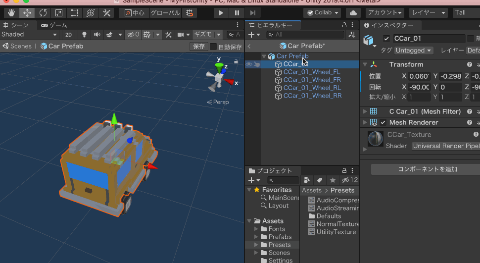

アニメーションを制御するコントローラーを設定します。AnimatorControllerの理想はコントローラーに周辺状況を渡し、コントローラー側で判断してもらう形にすることです。今回の場合は、ハンドル情報を渡して車を傾けてもらいます。

最終的には、地面と接触しているか、車の速度は…等を渡せばコントローラー側で適切なアニメーションを選択するのが理想です。

-  `Animator > コントローラー` に `CarPrefab` が設定されているので、ダブルクリック。AnimatorControllerウインドウが開く。以下AnimatorController内での操作を行う
-  LeftTurnとRightTurnノードが登録されているので、選択して右クリック、削除。全てのノードを削除
-  パラメータータブ（ウインドウ左上）を選択し、**+** ボタン → **float** を選択。名前はHandleとする。この表示が無い場合、ウインドウ左上の目玉マークを押す。
-  ウインドウを右クリックし、`ステートの作成 > 新規のブレンドツリーから` を選択。Blend Treeノードが作成される。
-  Blend Treeノードをダブルクリック、Blend Tree編集画面に移る
-  Blend Tree編集画面のBlend Treeノードを選択
-  Motionの **+** を押し、 **モーションフィールドを追加** を選択。「なし（モーション）」に先ほど作成した **LeftTurn** を追加
-  Motionの **+** を押し、 **モーションフィールドを追加** を選択。「なし（モーション）」に先ほど作成した **RightTurn** を追加
-  Blend Treeの最小値（Parameterの下の０と書いてある数値は実は変更できる）を、０から **-1**に変更
-  Hierarchyの **<** を押してプレハブモードを抜ける。

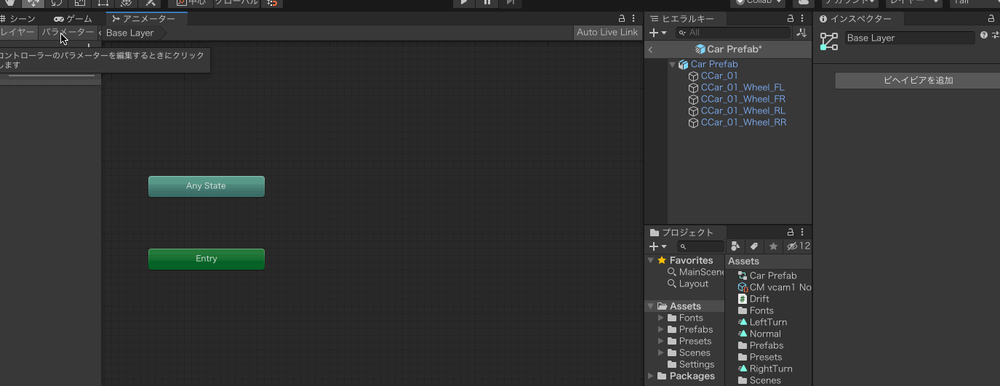

最後にコントローラーに現在のパラメーターを渡す処理を記述します。

-  `UpdateAnimationParameter` スクリプトを作成し、下のコードを記述します。
-  Playerを選択し、`UpdateAnimationParameter`を追加します。
-  `UpdateAnimationParameter > Animator` に、シーン上のCarPrefabを選択します。

```
using UnityEngine;

public class UpdateAnimationParameter : MonoBehaviour
{
    public Animator animator;

    ICar car;

    public static int hashHandle = Animator.StringToHash("Handle");

    void Awake()
    {
        TryGetComponent<ICar>(out car);
    }

    void Update()
    {
        animator.SetFloat(hashHandle, car.Handle);        
    }
}
```

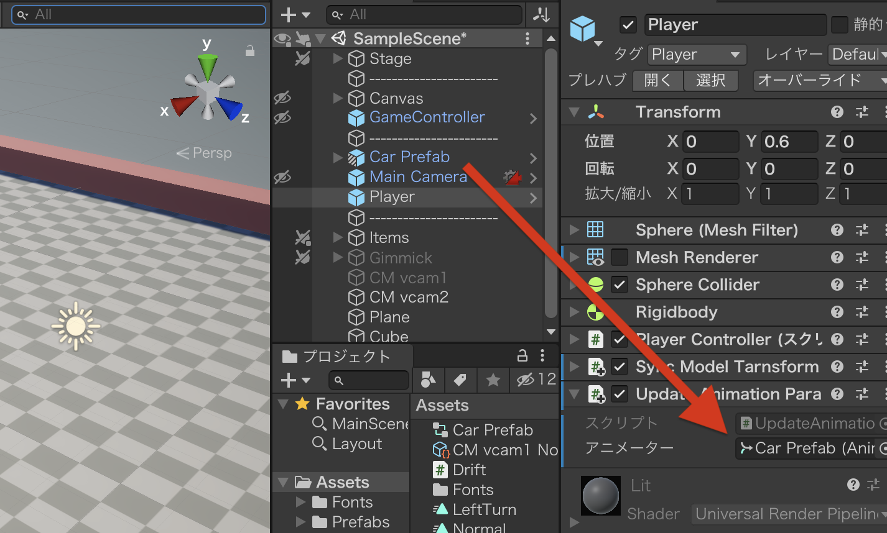

# ドリフト時の土煙を表現しよう！

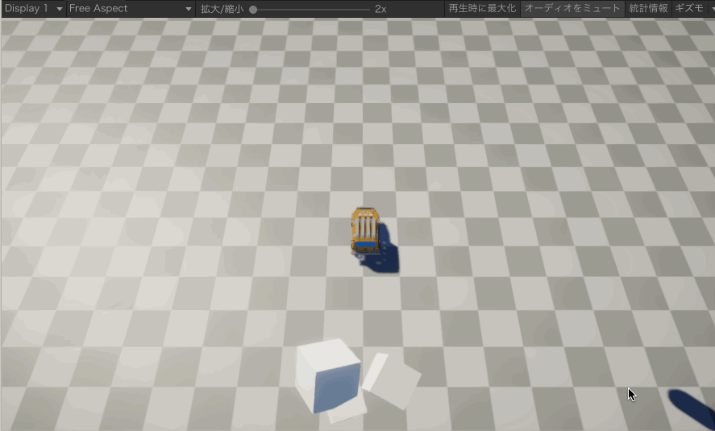

ドリフト（移動したい方向と実際の向きが異なる）場合に土煙が出るようにします。

この辺りは実際には少し調整しながら確認するべきです。手順も若干フワっとしています。

-  `メニュー > アセット > マテリアル` を選択。名前はSmoke Materialとする。
-  Smoke MaterialのShaderを **Particle > Standard Surface** に変更する。URPならば **Universal Render Pipeline / Particle / Simple Lit** シェーダーを使用する。
-  `メニュー > ゲームオブジェクト > エフェクト > パーティクル ` を選択し、パーティクルシステムを作成
-  作成したParticle SystemオブジェクトをSmokeに改名
-  SmokeをCar Prefabの子の最後尾（一番下）に移動
-  座標をCarPrefabの後ろタイヤの下辺りに設定。数値にすると大体 (0, 0.072, -0.363）
-  Smokeの向きは若干上向きにしておきます。数値にすると (-63, 0, 0）

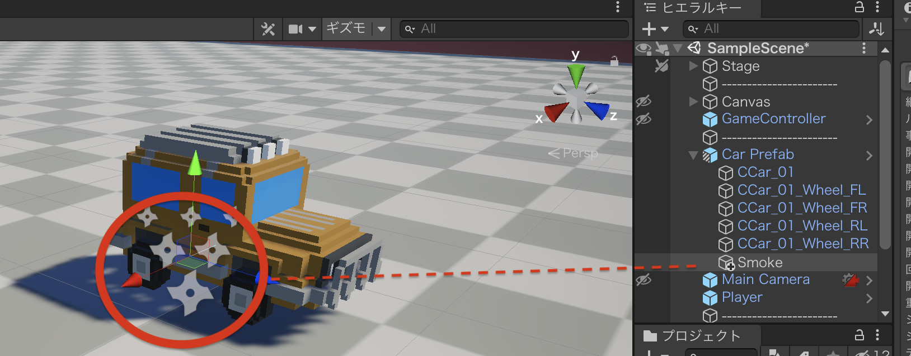

ここから、Smokeパーティクルの設定を行います。

-  `開始時の生存期間` の右にある **▼** を押し **2つの値間でランダム** を選択、値は **1** と **3** を変更
¸-  `開始時の角度` の右にある **▼** を押し **2つの値間でランダム** を選択、値は **0** と **180** を変更
-  `開始時の速度` を5から **1** に変更
-  `シミュレーション空間` をローカルから **ワールド** に変更
-  `放出 > 時間ごとの率` を10から **30** に変更
-  `形状 > 形状` を 円錐から **エッジ** に変更
-  `形状 > Radius` を 1から **0.25** に変更
-  `形状 > 方向をランダム化する` を0から **0.5** に変更
-  `生存期間のサイズ` にチェックを入れる
-  `生存期間のサイズ > サイズ` を、最初 0.25、中間 1、最後 0 のようなカーブを描かせる
-  `レンダラー > レンダーモード` をビルボードから **メッシュ** に変更
-  `レンダラー > メッシュ` を Cube に設定
-  ` レンダラー > マテリアル` を`Snoke Material` に変更

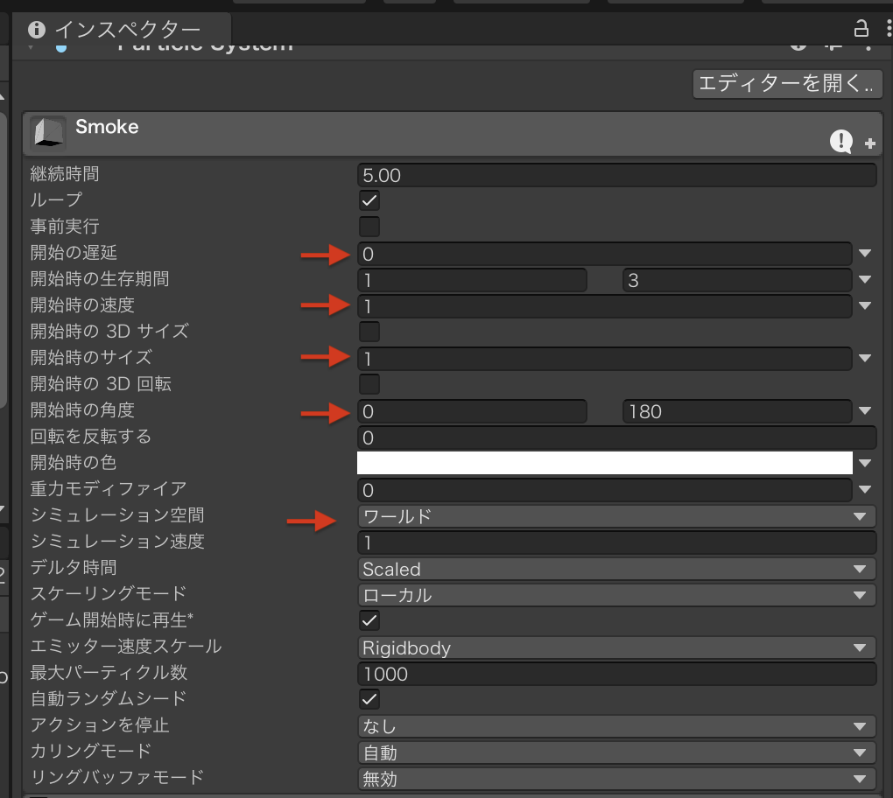
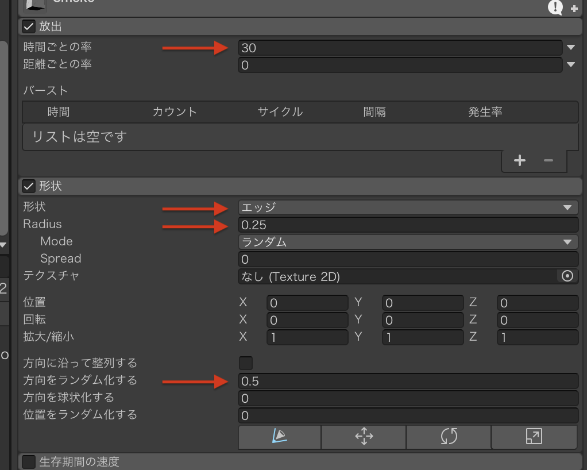
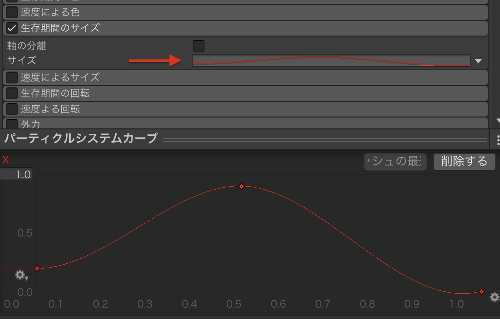
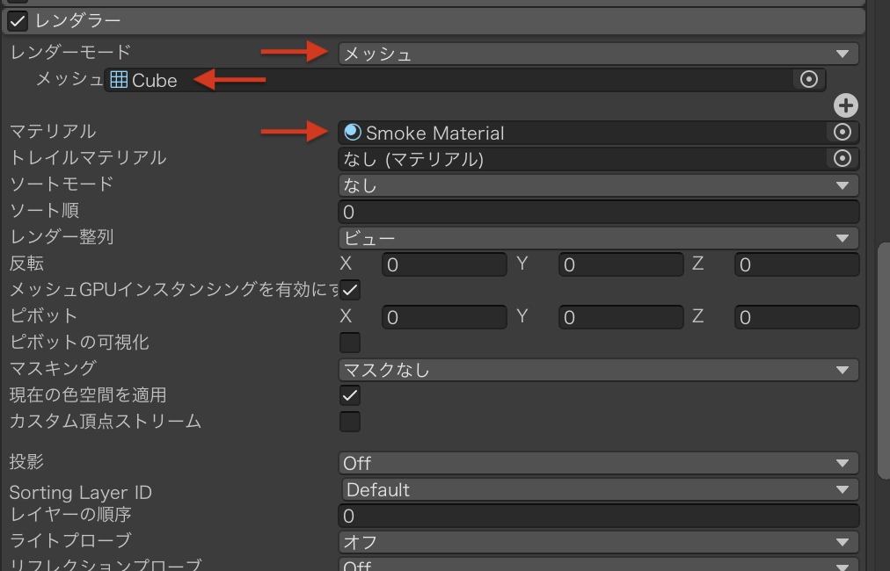

再生した時に煙っぽいなーと感じればOKです。この辺りは感性で調整してください。

次はドリフト中のみパーティクルが出るようにスクリプトを作成します。

-  `Drift` スクリプトを作成
-  Playerを選択し「コンポーネントを追加」を押下、 `Drift` をPlayerに追加
-  `Drift` の中身を以下のように変更
-  `Drift > Smoke` に、上で作成したSmokeオブジェクトを登録

```cs
using UnityEngine;

public class Drift : MonoBehaviour
{
    public ParticleSystem particle;

    ParticleSystem.EmissionModule emission;
    ICar car;
    Rigidbody rig;

    void Awake()
    {
        TryGetComponent<ICar>(out car);
        TryGetComponent<Rigidbody>(out rig);
    }

    void Start()
    {
        emission = particle.emission;
    }

    void Update()
    {
        var dot = Vector3.Dot(rig.velocity.normalized, car.Forward);
        emission.enabled = dot < 0.8f;
    }
}
```

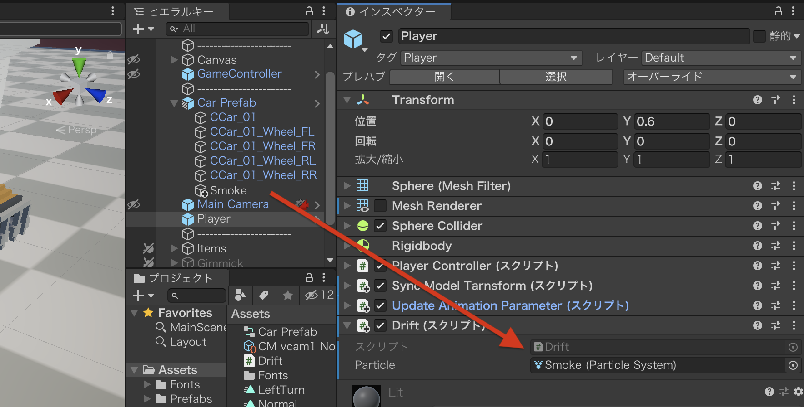

## カメラの動きを設定しよう！

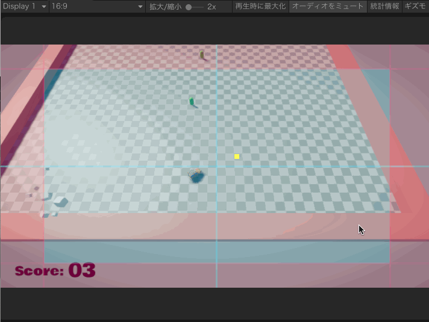

Roll a Ball 標準のカメラコントローラーも悪くないですが、ダンピングや先読み、画面の揺れ等も追加となると面倒なので、既存の機能を使います。

最初にパッケージの導入します。

-  `メニュー > ウインドウ >  PackageManager` を選択
-  もし＋の隣が「プロジェクト内」担っている場合、 **すべてのパッケージ** に変更
-  パッケージ一覧から **Cinemachine** を選択し、**Install** ボタンを押す

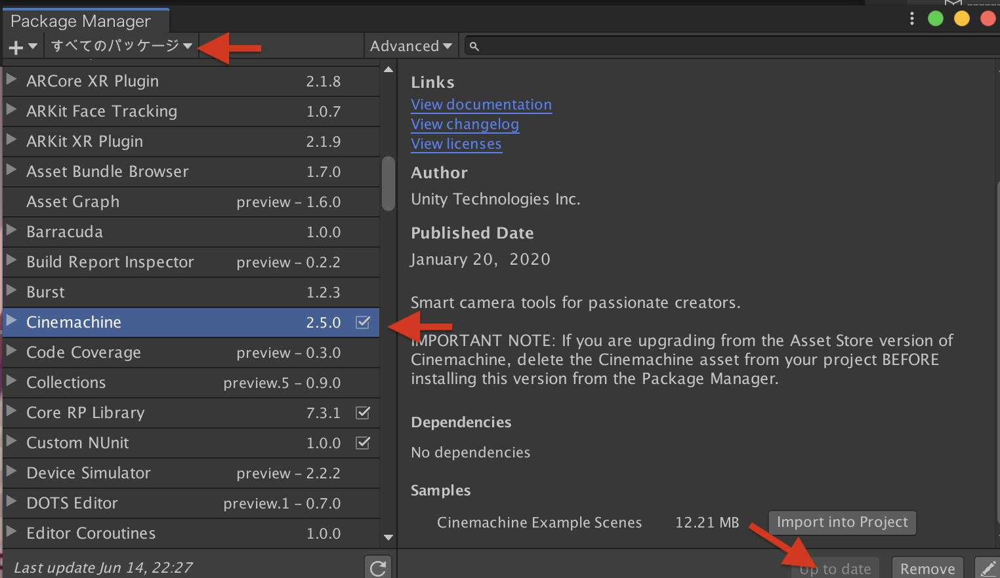

既存のカメラをCinemachineのカメラリグに変更します。

-  MainCameraオブジェクトを選択し、 `FollowCamera` スクリプトを右クリック、**コンポーネントを削除**を選択
-  `メニュー > Cinemachine > Create Virtual Camera` を選択し、CM vcam1を作成
-  CM vcam1を選択
-  **Follow** に シーン上の **Car Prefab** を設定
-  **Body** のTransposerを **Framing Transposer** に変更
-  Aimは **Do Nothing** を設定
-  CM Vcam1 のTransformの回転を **(60, 0, 0)** に設定
-  Body > Lookahead Time（移動先を予想してカメラを向ける） を **0.5** に設定
-  Body > Lookahead Smoothing（移動先予想地点へカメラを向けるスムーズさ）は **5** を設定
-  Body > Canera Distanceは **20** を設定

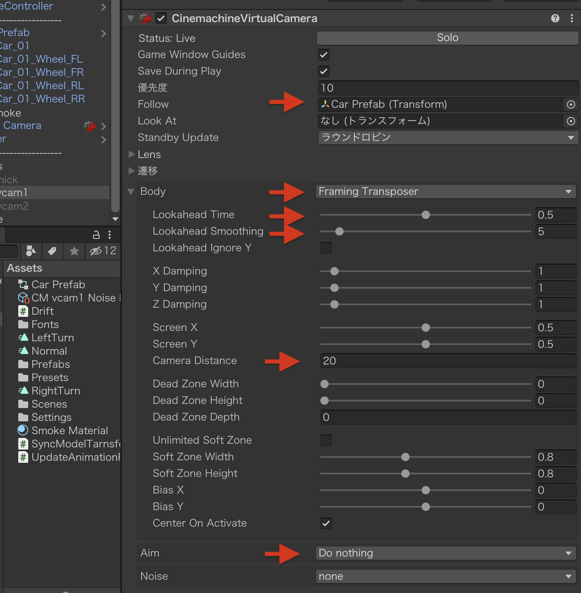

でも、どうせならカーレーシングっぽいカメラワークに変更します。

-  CM vcam1を非アクティブに変更
-  `メニュー > Cinemachine > Create Virtual Camera` を選択し、CM vcam2を作成
-  FollowとLookAtにCar Prefabオブジェクトを選択
-  Body > Follow Offsetは(0, 3, −5)を設定
-  Body > X Dampingを3に変更
-  Aim > Tracked Object Offsetを 1.9 に設定
-  Aim > Soft Zone WIdthを0に設定

ついでに障害物との接触時にカメラを揺らします

-  Add Extensionsで Cinemacinhe ImpulseListenerを追加
-  PlayerにCinemachineCollisionImpulseSourceを追加
-  Raw Signalは6D Shakeを設定（選択時、目玉マークをクリックしないと表示されません）
-  Amplitude GainとFrequency Gainを3に設定
-  Time Envelope > Sutain Timeを0.1に設定
-  Ignore TagにItemを設定